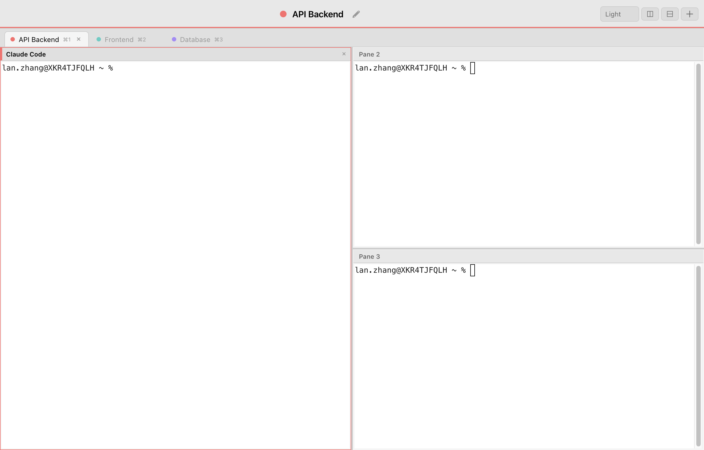
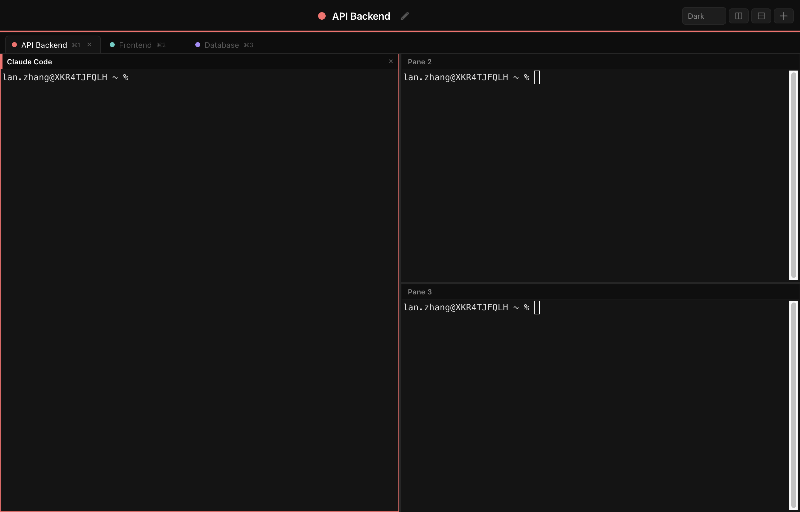
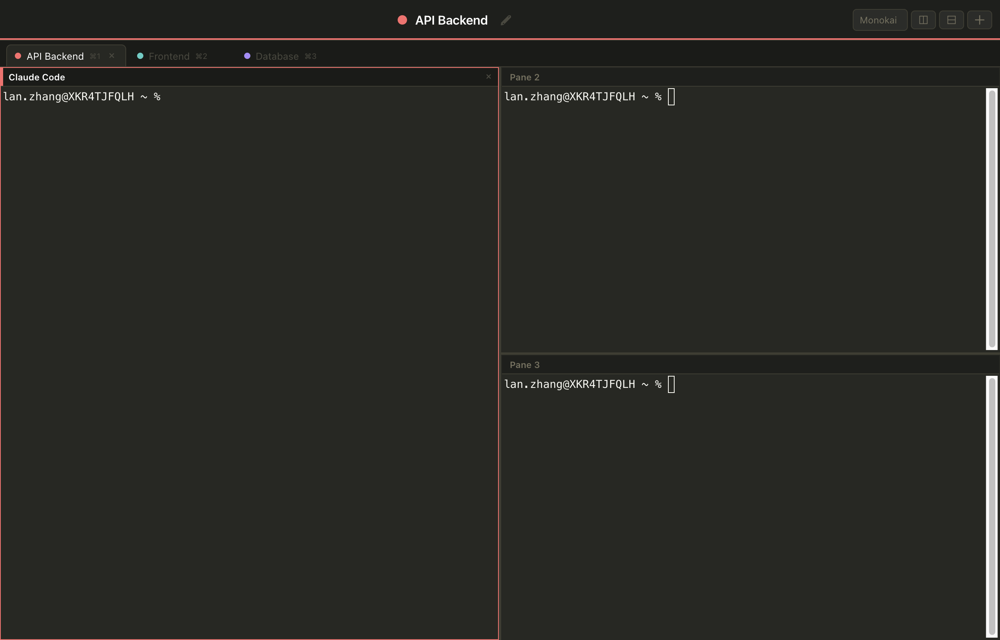

# Frybox

A terminal app built for managing multiple CLI sessions with clear visual identity. Named tabs, named split panes, drag-to-rearrange, and multiple themes.


## Screenshots

### Named sessions with split panes (Light theme)



Three color-coded session tabs, each with named split panes. The focused pane gets a colored accent bar.

### Dark theme



### Monokai theme



## Features

- **Named sessions (tabs)** — each tab has a large, prominent name in the titlebar
- **Named split panes** — split vertically/horizontally, each pane has its own editable name
- **Color-coded** — 8 distinct colors cycle across sessions for instant recognition
- **Drag-and-drop** — grab a pane header and drop it on another to swap positions
- **Keyboard swap** — `⌘⌃W/A/S/D` to swap the focused pane in any direction
- **4 themes** — Dark, Light, Solarized Dark, Monokai (persisted across restarts)
- **macOS app** — builds as a native `.app` with custom icon

## Install from source

Requires [Node.js](https://nodejs.org/) (v18+).

```bash
git clone https://github.com/lanzhgx/frybox.git
cd frybox
npm install
npm start
```

> If `npm install` fails to reach npmjs.org, use a mirror:
> ```bash
> npm install --registry https://registry.npmmirror.com
> ```

## Build as macOS app

```bash
npm run dist
```

This creates `dist/mac-arm64/Frybox.app` and `dist/Frybox-*.dmg`. Copy the `.app` to `/Applications`:

```bash
cp -R "dist/mac-arm64/Frybox.app" /Applications/
```

> The app is unsigned. On first launch, right-click → Open, or allow it in System Settings → Privacy & Security.

## Keyboard shortcuts

### Sessions (tabs)

| Shortcut | Action |
|---|---|
| `⌘T` | New session |
| `⌘⇧W` | Close session |
| `⌘⇧R` | Rename session |
| `⌘⇧]` / `⌘⇧[` | Next / previous session |
| `⌘1`–`⌘9` | Jump to session by position |

### Panes (splits)

| Shortcut | Action |
|---|---|
| `⌘D` | Split right |
| `⌘⇧D` | Split down |
| `⌘W` | Close pane |
| `⌘R` | Rename pane |
| `⌘]` / `⌘[` | Next / previous pane |
| `⌘⌥←↑↓→` | Focus pane by direction |
| `⌘⌃A/W/S/D` | Swap pane left/up/down/right |

### Other

| Shortcut | Action |
|---|---|
| Drag pane header | Swap pane positions |
| Theme dropdown | Switch between Dark / Light / Solarized / Monokai |

## Tech stack

- [Electron](https://www.electronjs.org/) — app shell
- [xterm.js](https://xtermjs.org/) — terminal emulator
- [node-pty](https://github.com/nicknisi/node-pty) — PTY backend

## License

MIT
